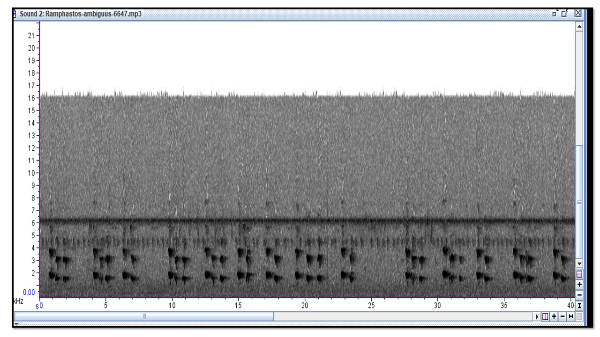
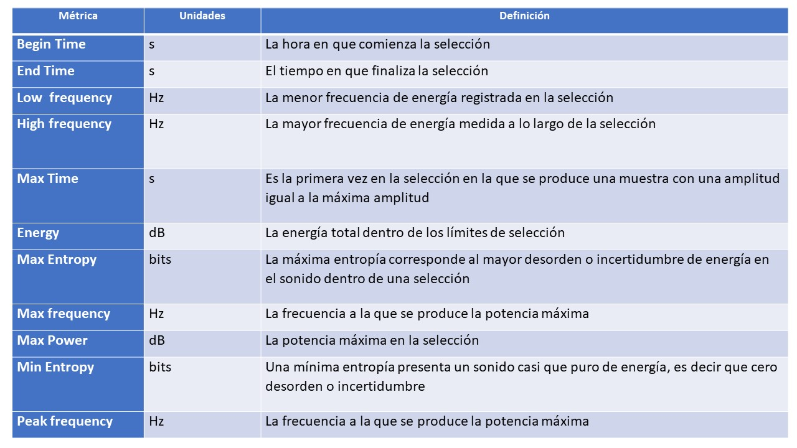

 **Bioacústica**

La Bioacústica consiste en el estudio del comportamiento de comunicación de los animales a través de señale sonoras, estas señales  pueden ser una herramienta adecuada para descubrir y confirmar las diferencias entre especies (Tubaro, 1999). También las grabaciones de sonidos desempeñan un importante papel al permitir conocer y reconocer nuestra gran diversidad biológica, y es uno de los primeros pasos para poder conservarla. En el caso de las aves, las vocalizaciones que emiten son de los sonidos más complejos y uno de sus principales medios de comunicación. (Soncco, 2017). 

\
\

**Figura 3**: Espectograma del *Ramphastos ambiguus*

\
\
\
\
\

##Métricas y su significado

 

**Figura 4**: Metricas utilizadas en este trabajo

\
\
\

**Referencias bibliograficas**
\

Tubaro, P. L. (1999). Bioacústica aplicada a la sistemática, conservación y manejo de poblaciones naturales de aves. Etología, 7(3), 19-32.

Soncco, R. S. (2017). Extracción de características basada en NMF para la clasificación de especies de aves usando señales de audio.

