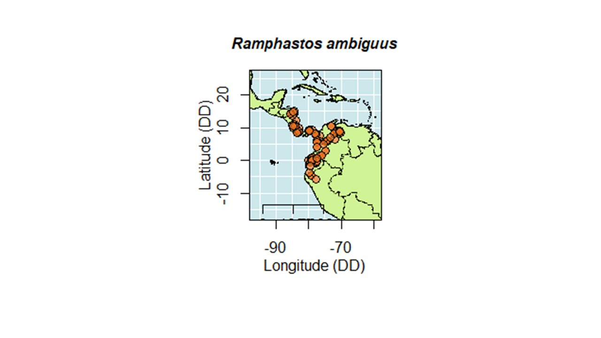

**Descripción de la especie:** Tamaño mediano ( 56 cm, 750g), pico bicolor: amarillo brillante y marrón. Mayor parte del plumaje de color negro con tintes de marrón en la coronilla, parte posterior del cuello y espalda. Cara, garganta y pecho amarillo brillante, seguido por línea roja a nivel de pecho. Plumas cobertoras de la cola blancas. Patas azul brillantes (ecobiosis, s.f.; Figura 1).

\
\
\
**Fifura 1**

\
\

**Rango de distribución:** Residente de las bajuras del caribe hasta los 1200 msnm. En el pacífico hasta los 1850 msnm. En Costa Rica se distribuye en el Pacífico Central y Sur, Zona Norte, Valle Central, Caribe Norte y Sur. En el mundo desde Honduras al norte de Suramérica (ecobiosis, s.f. ; Stiles y Skutch, 2007 ).

**Hábitat:** Domina en los árboles en fructificación, bandadas pequeñas que se desplazan entre el dosel del bosque y las áreas despejadas. Buscan frutas principalmente, pero también comen insectos, lagartijas, culebras y pichones de otros nidos (Stiles y Skutch, 2007). Figura 2 

Figura 2:Mapa de distrubucion 

**Hábitos:** En general dominan los árboles en fructificación, se desplazan en bandadas pequeñas por entre el dosel del bosque y áreas parcialmente despejadas, también se les observa en claros con árboles remanentes, se alimentan de fruta y complementan con insectos, lagartijas, culebras ocasionales y pichones de los nidos.

**Voz:** Un chillido o gañido yo-YIP a-yip, a-yip que repite a menudo. En el atardecer las bandadas se congregan en árboles o tocones secos altos y suelen cantar en coro.
Nido: Suelen ubicar los nidos en cavidades causadas por pudrición en un árbol vivo u ocasionalmente en un nido viejo de carpintero.

\
\

**Referencias bibliográficas**

Charif, RA, AM Waack, and LM Strickman. 2010. Raven Pro 1.4 User’s Manual. Cornell Lab of Ornithology, Ithaca, NY

Ecobiosis. (s.f.). Ficha especie: Ramphastos ambiguus Swainson. Recuperado de: http://ecobiosis.museocostarica.go.cr/especies/ficha/2/4387 el 5 de marzo, 2019.

Stiles, F. G., & Skutch, A. F. (2007). Guía de aves de Costa Rica. Editorial INBio.

